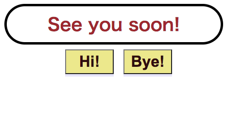

# 103 React Overview
This lab is to help you recap and do all/most of the things we’ve covered in class. (React
101/102)

Finishing example:
**This is the Left Text**
| Show Right | Show Left |

## Challenge 1
1. Open a new codesandbox(https://codesandbox.io/s/) project with react framework
2. Make a new class component
3. Make a state that is a boolean.
4. Inside the class component. Make a title tag with h1. Inside the h1
tag, add a conditional operator to show different text using the
boolean state you made in no.3.
5. Make 2 buttons to update the boolean state.



### App.js
```js
import React from "react";
import './App.css';

export default function App() {
  return (
    <Clickevent />
  );
}

function MeetGreeting(props) {
return <h1>Welcome!</h1>;
}

function LeaveGreeting(props) {
return <h1>See you soon.</h1>;
}


class Clickevent extends React.Component {
  
  state = {
    Greeting: "Hello, how are you?"
  };

  Leaving = () => {
    this.setState({
      Greeting: "See you soon!"
    })
  }

  Coming = () => {
    this.setState({
      Greeting: "Hello, how are you?"
    })
  }

  render() {
      return (
          <>
              <h1 class="sentence">{this.state.Greeting}</h1>
              <button onClick={this.Coming}>Hi!</button>
              <button onClick={this.Leaving}>Bye!</button>
          </>
      );
  }
}
```

### App.css
```css
#root {
  text-align: center;
  font-size: 18px;
}

.sentence {
  width: 400px;
  margin: 10px auto;
  text-align: center;
  border: 5px solid black;
  border-radius: 50px;
  padding: 10px 20px;
  display: flex;
  justify-content: center;
  align-items: center;
  color: brown;
}

button {
  width: 100px;
  background-color: khaki;
  margin-left: 20px;
  padding: 5px 10px;
  font-size: 2rem;
  font-weight: 700;
  color: rgb(49, 13, 13);
  box-shadow: 0 5px lavender;
  cursor: pointer;
}

button:active {
  box-shadow: none;
  position: relative;
  top: 5px;
}
```

Another solution: Using function comp as a parent and class comp as a child
App.js
```js
// React から　useStateをインポート (関数コンポーネントにてstateが必要な時に使う)
import React, {useState} from "react";
import './App.css';
import Greeting from "./Greeting";


export default function App() {
  // 新しいstate変数である count を宣言する　(関数コンポーネントにてstateが必要な時に使う)
  const [greet, setGreet] = useState("Hello");

  const toggleLeaving = () => {
    setGreet("You are leaving")
  };

  const toggleComing = () => {
    setGreet("You are coming")
  }

  return (
    <div className="App">
      <Greeting 
        greet={greet}
        toggleLeaving= {toggleLeaving}
        toggleComing= {toggleComing}
      />
    </div>
  );
}
```

Greeting.jsx
```js
// child
import React from "react";

class Greeting extends React.Component {
constructor(props){
    super(props);
}

render() {
    return (
        <>
            <h1 class="sentence">{this.props.greet}</h1>
            <button onClick={this.props.toggleComing}>Hi!</button>
            <button onClick={this.props.toggleLeaving}>Bye!</button>
        </>
    );
}
}

export default Greeting;
```


Challenge 2

In this example, Loading students… is switched to a
list of students after 3 seconds! Try doing something like
this!

1. Make a StudentList component
2. Using Array.map(), show all the names of the student in a list
3. StudentList component is going to receive that array as props from
the parent (App.js).
4. From the parent, send that array after 3 seconds. (Hint! Use state
in the parent comp to add students data. Also you can use
setTimeOut, to set data to that state)
5. While waiting for that data, show loading UI
6. Bonus: Add a button to shuffle the student list

Deliverables
Submit your codesandbox link in google classroom!